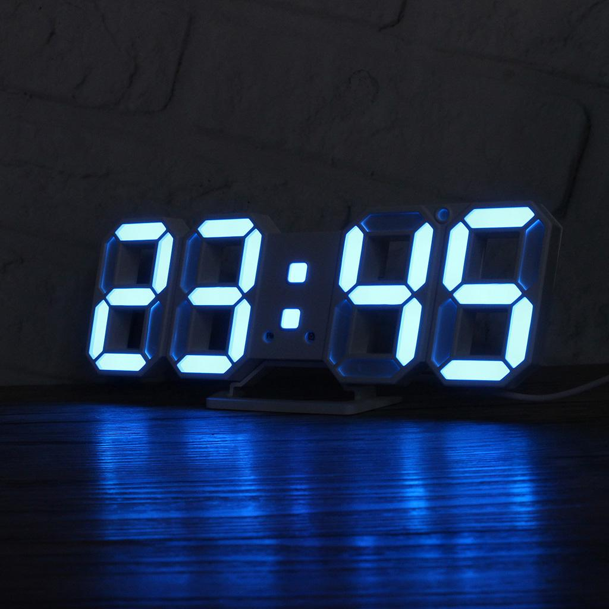

# Digital-Clock

### Description:

The project is based on a digital clock. This helps us when we know the present time but can’t keep a record of the future time. It is similar to a watch. Once you set the present time, it works the same way as a watch does. It also has feature called the *'Day Change Indicator'*. This is an infinite loop program. One can close the terminal window for termination of the execution.

 

  

### Libraries used in the code:

1. **stdio.h** - The header file stdio. h stands for Standard Input Output. It has the information related to input/output functions.
2. **unistd.h** - The header file unistd.h is the name of the header file that provides access to the POSIX operating system API. It defines miscellaneous symbolic constants and types, and declares miscellaneous functions.

### Modules used in the code:

+ **time** module **sleep** funtion - This module provides various time-related functions. Python time sleep function is used to add delay in the execution of a program. It is used to halt the execution of the program for given time in seconds.

---

#### Video links:

1. Demo 1 (in C): https://youtu.be/2M55Bycmj7o
2. Demo 2 (in C): https://youtu.be/XvpgKWp3Nj8
3. Demo 1 (in Python): https://youtu.be/9T3QJolDhnY
4. Demo 2 (in Python): https://youtu.be/e7PHqRpybYI
